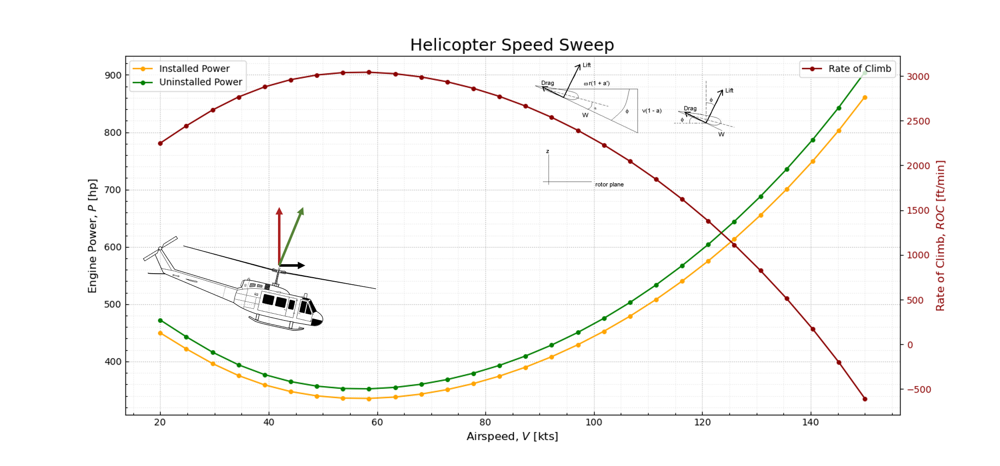

# helipypter



heliPypter is a package for rotorcraft performance evaluation. Rotorcraft attributes are provided as input, 
and performance characteristics such as Engine Horsepower, Specific Range, and Fuel consumption are evaluated.

heliPypter has an object oriented philosophy, so different rotorcraft configurations can be built, modified,
and evaluated quickly, with the same methods. The classes have methods for Hover in and out of Ground Effect
(HOGE and HIGE), as well as forward flight.

Under the hood, briefly speaking, the code applies Momentum Theory assuming constant chord ideal twist. 
For forward flight, Glauert's Model is used.

## Installation:

For most sytems, the easiest way to install this package is through the Python Package Index:

```
$ pip install helipypter
```

## Documentation

This package has full documentation on [readTheDocs](https://helipypter.readthedocs.io/). The 'API' page is fully documented and shows
what different members of each class are, and what methods are available. The entire documentation will be
expanded as the package is developed.


Like this package or my work? Feel free to [buy me a coffee](https://www.buymeacoffee.com/czarified).
All donations will be used as developer fuel!


#### Attributions
Huey Graphic by Jetijones - Own work, CC BY 3.0, https://commons.wikimedia.org/w/index.php?curid=15743299
Blade Element graphic by Smilesgiles89 - MS Paint, CC BY-SA 3.0, https://en.wikipedia.org/w/index.php?curid=38336902