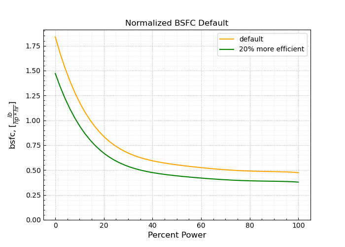
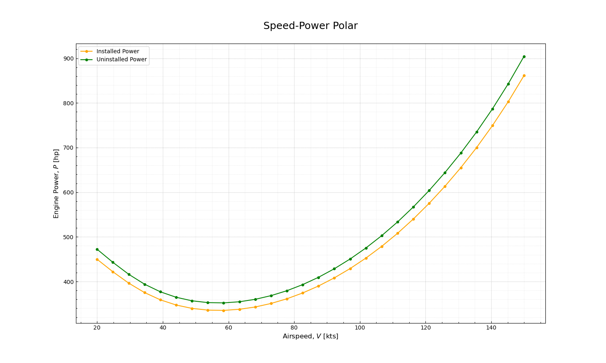

Analysis With heliPypter
========================

Basic Flight Performance
------------------------

Using heliPypter, performance for a traditional helicopter with single main and tail rotors can be evaluated.
The first step is defining all the inputs (there are many). The details of all inputs are fully documented on
the `API page <https://helipypter.readthedocs.io/en/latest/api.html>`_.

.. warning::
    Units are important, so make sure they are all Imperial!
    Metric and automated units with `Pint <https://pint.readthedocs.io/en/0.10.1/>`_ may be supported in a future release.
    If you want it, post on the `issues <https://github.com/Czarified/helipypter/issues>`_ page.

The Helicopter class takes numeric weight values for fuel, and a single lumped value for all other masses. It then 
adds the remaining fuel weight and empty mass whenver you call the heli.GW property. Let's use an empty weight fraction
to generate this helicopter.

.. code-block:: python

   import helipypter.vehicles as vh
   
   # Empty weight fraction
   EW_frac = 0.528
   # Total Gross Weight
   GW_total = 5000
   # Crew Weight
   w_crew = 200
   # Trapped Fluids
   w_fluids = 13

   w_empty = EW_frac*GW_total + w_crew + w_fluids
   # Our payload is 6 people @ 213 lbs each
   w_payload = 6*213
   w_fuel = GW_total - w_empty - w_payload

   doc_chopper = vh.Helicopter(name='Documentation Helicopter Spec',
                            MR_dia = 35,
                              MR_b = 4,
                             MR_ce = 10.4,
                          MR_Omega = 43.2,
                            MR_cd0 = 0.0080,
                            TR_dia = 5.42,
                              TR_b = 4,
                             TR_ce = 7,
                          TR_Omega = 239.85,
                            TR_cd0 = 0.015,
                          GW_empty = w_empty,
                           GW_fuel = w_fuel,
                        GW_payload = w_payload,
                          download = 0.03,
                                fe = 12.9,
                            l_tail = 21.21,
                              S_vt = 20.92,
                             cl_vt = 0.22,
                             AR_vt = 3
                                  )

.. note::
    The Main Rotor Blade incompressible minimum drag, *MR_cd0*, is a vehicle characteristic. If we could clean up 
    this blade drag term, it would logically affect all flight performance, so it's included here in 
    the base definition of the vehicle.

    The same goes for the airframe equivalent flat-plate drag, *fe*. If we were to perform an airframe 
    drag cleanup design cycle on our vehicle, we can reduce this term here, or scale it however you want.

The Helicopter class has many default values. Some aren't shown here, so it's always good idea to check the
vehicle definition using a simple print function.

.. code-block:: python

    print(doc_chopper)

    -.-.-.-.-.-.-.-.-.-.-.-.-.-.-.-.-.-.-.-.-.-.-
           Documentation Helicopter Spec        
    Rotors: ('MR', 'TR')
    -.-.-.-.-.-.-.-.-.-.-.-.-.-.-.-.-.-.-.-.-.-.-
    Main Rotor Inputs:
               MR_dia:  35.000 [ft]
                 MR_b:   4.000 []
                MR_ce:  10.400 [in]
             MR_Omega:  43.200 [rad/s]
               MR_cd0:   0.008 []
                 MR_R:  17.500 []
                 MR_A: 962.113 []
              MR_vtip: 756.000 []
               MR_sol:   0.063 []
    -.-.-.-.-.-.-.-.-.-.-.-.-.-.-.-.-.-.-.-.-.-.-
    Tail Rotor Inputs:
               TR_dia:   5.420 [ft]
                 TR_b:   4.000 []
                TR_ce:   7.000 [in]
             TR_Omega: 239.850 [rad/s]
               TR_cd0:   0.015 []
                 TR_R:   2.710 []
                 TR_A:  23.072 []
              TR_vtip: 649.993 []
               TR_sol:   0.274 []
    -.-.-.-.-.-.-.-.-.-.-.-.-.-.-.-.-.-.-.-.-.-.-
    Airframe Data:
             GW_empty: 2853.000 [lbs]
              GW_fuel: 869.000 [lbs]
           GW_payload: 1278.000 [lbs]
             download:   0.030 [.%]
          HIGE_factor:   1.200 []
                   fe:  12.900 [ft2]
               l_tail:  21.210 [ft]
                 S_vt:  20.920 [ft2]
                cl_vt:   0.220 []
                AR_vt:   3.000 []
    -.-.-.-.-.-.-.-.-.-.-.-.-.-.-.-.-.-.-.-.-.-.-
    Engine Data:
           eta_MRxsmn:   0.985 [.%]
           eta_TRxsmn:   0.971 [.%]
          eta_xsmn_co:   0.986 [.%]
             eta_inst:   0.950 [.%]
             xsmn_lim: 674.000 [hp]
              pwr_lim: 813.000 [hp]
    -.-.-.-.-.-.-.-.-.-.-.-.-.-.-.-.-.-.-.-.-.-.-

.. note::
    Not shown here are the engine Brake-Specific Fuel Consumption factors. Four factors can be provided, 
    defining a polynomial function to return the bsfc, in *[lbs/(hp*hr)]*. See :class:`helipypter.vehicles.Helicopter` 
    method *Helicopter.bsfc*.
    

The heli object can now be called to hover, burn fuel, idle, lookup engine power, or fly. However, before we
can perform any flight maneuvers, atmospheric properties must be supplied. Here, we create an Environment class.
For example, to create a Sea-level standard atmosphere and hover at it:

.. code-block:: python

    atm = vh.Environment(alt=0)

    output = heli.HOGE(atm)
    print('-.-.-.-.-.-.-.-.-.-.-.-.-.-.-.-.-.-.-.-.-.-.-')
    print('{:^45}'.format('Results - HOGE'))
    print('-.-.-.-.-.-.-.-.-.-.-.-.-.-.-.-.-.-.-.-.-.-.-')
    for k,v in doc_chopper.HOGE(atm).items():
        print('{:>17}:  {:>7.4}'.format(k, v))

Hover Out of Ground Effect (HOGE) returns dictionary of the flight point predictions. Sometimes, dictionary output isn't
the easiest to read, even though it's easy to lookup. So we created a simple loop to print the data.

.. code-block:: python

    -.-.-.-.-.-.-.-.-.-.-.-.-.-.-.-.-.-.-.-.-.-.-
                Results - HOGE
    -.-.-.-.-.-.-.-.-.-.-.-.-.-.-.-.-.-.-.-.-.-.-
                    a:    5.717
              delta_0:  0.009518
                   Ct:  0.003937
            TR_thrust:    291.1
                 Cq_i:  0.0001787
                 Cq_v:      0.0
                 Cq_0:  7.502e-05
                 Cq_1:  -1.037e-05
                 Cq_2:  1.317e-05
                   Cq:  0.0002565
                    Q:  6.174e+03
                 P_MR:  2.425e+05
                HP_MR:    485.0
                HP_TR:     45.3
              SHP_ins:    566.0
            SHP_unins:    595.8
                  sfc:   0.4982

.. note::
    One of the optional inputs to the HOGE method is *k_i*. This number is the correction factor for non-uniform 
    inflow, linear twist, and taper. It's defaulted to 1.1, and will typically be between 1 and 1.15.

Forward flight performance can be evaluated just as easily. Let's perform a speed sweep from 20 knots to 150 knots. The 
forward_flight method just takes an Environment for atmospheric properties, and either a single or list of airspeeds. 
This method returns a pandas dataframe that has several columns. It's sometimes hard to view this data, so heliPypter 
has convenient plotting functions.

.. code-block:: python

    import numpy as np
    import helipypter.funcs as func

    # Create an array of 14 equally spaced airspeed values
    # This is just a little shorthand and not necessary.
    speeds = np.linspace(20, 150, num=14)
    
    data = doc_chopper.forward_flight(atm, speeds)

    fig, ax = func.speed_power_polar(data)

There's lots of other data in this dataframe, and built-in functions exist to plot range and rate-of-climb. For now we'll 
stop here and move on to mission analysis.

Mission Analysis
----------------

The first step here is obviously to create a mission. Currently, there's no built-in classes representing a mission, because 
the contents of a mission are a simple collection of *mission points*, where each point has maneuver inputs. This data structure 
is very easily represented as a *namedtuple*. You can decide how you want to approach the specifics of mission analysis, this 
just one example. All helipypter classes should be flexible enough to fit your needs.

.. note::
    In the future, this may change with some built-in missions, or a slightly different structure to make aircraft sizing 
    straight-forward. At the time of creation, this was enough for me and I didn't need to bother with the overhead of a custom class.

.. code-block:: python

    from collections import namedtuple

    Point = namedtuple('MissionPoint', ['maneuver', 'altitude', 'duration', 'speed'])
    startup = Point(maneuver='idle', altitude=0, duration=1, speed=0)
    takeoff = Point(maneuver='IRP', altitude=0, duration=1, speed=0)
    climb_0 = Point('MCP', 0, 5, 1000)
    cruise_0 = Point('flight', 5000, 160, 110)
    hover_1 = Point('hover', 0, 1, 0)
    loiter = Point('loiter', 5000, 10, 60)
    unload = Point('unload', 0, 5, 1278)
    ground = Point('idle', 0, 1, 0)

    mission = (startup, takeoff,
           climb_0, cruise_0, loiter,
           hover_1, unload, hover_1,
           climb_0, cruise_0,
           hover_1, ground
          )

We've got a mission now, let's create a function to run the helicopter through the mission, burning fuel and changing weight 
as we go. We'll just use logging to print everything out to the console. If you have multiple missions and vehicles and you 
want to compare performance across them, you'll probably want to write all this data to anoter dataframe or dictionary.

This is a lot of clunky code. I'm sure it can be written to be more pythonic. Most of it is just our logging statements, 
though. Essentially, we step through the mission and evaluate each point, determining the fuel required, removing that fuel 
weight from the total fuel weight, and logging the results.

.. code-block:: python

    import logging

    def mission_loop(heli, mission):
    '''This temp function performs all the logic to simulate the fuel burn of a mission.'''
        # Mission Loop
        logging.info('')
        logging.info('')
        logging.info('-.-.-.-.-.-.-.-.-.-.-.-.-.-.-.-.-.-.-.-.-.-.-')
        logging.info('{:^45}'.format('Project Spec Mission'))
        logging.info('-.-.-.-.-.-.-.-.-.-.-.-.-.-.-.-.-.-.-.-.-.-.-')
        # Initialize the range tracker
        mission_range = 0
        for point in mission:
            if point.maneuver == 'idle':
                fuel = heli.idle()/60 * point.duration
                heli.burn(fuel)
                logging.info(f'Idled for {point.duration}[mins].')
                logging.info(f'   Burned {fuel:.2f}[lbs] of fuel.')
                logging.info(f'   New GW = {heli.GW:.2f}[lbs], fuel: {heli.GW_fuel:.2f}')
                logging.info('')
            
            elif point.maneuver == 'hover':
                # Actually calculate the fuel cost for
                # hovering at an exact weight and altitude
                data = heli.HOGE(vh.Environment(point.altitude))
                fuel = data['sfc']*data['SHP_unins']*point.duration/60
                heli.burn(fuel)
                logging.info(f'Hovered for {point.duration}[mins], burning {fuel:.2f}[lbs] of fuel.')
                logging.info(f'   New GW = {heli.GW:.2f}[lbs], fuel: {heli.GW_fuel:.2f}')
                logging.info('')
            
            elif point.maneuver == 'loiter':
                data = heli.forward_flight(vh.Environment(point.altitude), point.speed)
                fuel = data.SHP_uninst[0]*data.bsfc[0]/60 * point.duration
                heli.burn(fuel)
                logging.info(f'Loitered at {point.speed}[kts] for {point.duration}[mins].')
                logging.info(f'   Burned {fuel:.2f}[lbs] of fuel.')
                logging.info(f'   New GW {heli.GW:.2f}[lbs], fuel: {heli.GW_fuel:.2f}')
                logging.info('')
            
            elif point.maneuver == 'IRP':
                # IRP is the engine rated limit
                sfc = heli.bsfc(100)
                fuel = sfc*1*heli.pwr_lim/60 * point.duration
                heli.burn(fuel)
                logging.info(f'Ran at IRP for {point.duration}[mins].')
                logging.info(f'   Burned {fuel:.2f}[lbs] of fuel.')
                logging.info(f'   New GW = {heli.GW:.2f}[lbs], fuel: {heli.GW_fuel:.2f}')
                logging.info('')
            
            elif point.maneuver == 'MCP':
                # MCP is defined as 95% of IRP
                sfc = heli.bsfc(95)
                fuel = sfc*0.95*heli.pwr_lim/60 * point.duration
                heli.burn(fuel)
                logging.info(f'MCP Climb for {point.duration}[mins] @ {point.speed}[ft/min].')
                logging.info(f'   Burned {fuel:.2f}[lbs] of fuel.')
                logging.info(f'   New GW = {heli.GW:.2f}[lbs], fuel: {heli.GW_fuel:.2f}')
                logging.info('')
                mission_range += 120*point.duration/60   # 120 kts has more ROC than 1000 TODO: Calculate this.
            
            elif point.maneuver == 'flight':
                data = heli.forward_flight(vh.Environment(point.altitude), point.speed)
                fuel = point.duration/data.SR[0]
                heli.burn(fuel)
                logging.info(f'Forward flight for {point.duration}[nm] @ {point.speed}[kts].')
                logging.info(f'   Burned {fuel:.2f}[lbs] of fuel.')
                logging.info(f'   New GW = {heli.GW:.2f}[lbs], fuel: {heli.GW_fuel:.2f}')
                logging.info('')
                mission_range += point.duration 
            
            elif point.maneuver == 'climb':
                # Represents a hover climb/descent NOT @ MCP
                # There's no range credit for a "climb" maneuver instead of an "MCP" maneuver.
                data = heli.HOGE(vh.Environment(point.altitude), Vroc=point.speed)
                fuel = data['sfc']*data['SHP_unins']*point.duration/60
                heli.burn(fuel)
                logging.info(f'Climb for {point.duration}[min] @ {point.speed}[ft/min]')
                logging.info(f'   Burned {fuel:.2f}[lbs] of fuel.')
                logging.info(f'   New GW = {heli.GW:.2f}[lbs], fuel: {heli.GW_fuel:.2f}')
                logging.info('')
            
            elif point.maneuver == 'unload':
                logging.info(f'Landed! Unloading {point.speed}[lbs] of cargo.')
                heli.unload(point.speed)
                fuel = heli.idle()/60 * point.duration
                heli.burn(fuel)
                logging.info(f'Idled for {point.duration}[mins], burning {fuel:.2f}[lbs] of fuel.')
                logging.info(f'   New GW = {heli.GW:.2f}[lbs], fuel: {heli.GW_fuel:.2f}')
                logging.info('')
                
        logging.info('')
        logging.info(f'Mission Complete! {heli.GW_fuel:.2f} [lbs] of fuel remaining.')
        logging.info(f'Total Range = {mission_range:.2f}[nm]')
        logging.info('-.-.-.-.-.-.-.-.-.-.-.-.-.-.-.-.-.-.-.-.-.-.-')
    
    mission_loop(doc_chopper, mission)

Results:

.. code-block:: 

    2020-05-02 21:16:07,914 -  INFO -  -.-.-.-.-.-.-.-.-.-.-.-.-.-.-.-.-.-.-.-.-.-.-
    2020-05-02 21:16:07,914 -  INFO -              Project Spec Mission             
    2020-05-02 21:16:07,914 -  INFO -  -.-.-.-.-.-.-.-.-.-.-.-.-.-.-.-.-.-.-.-.-.-.-
    2020-05-02 21:16:07,914 -  INFO -  Idled for 1[mins].
    2020-05-02 21:16:07,914 -  INFO -     Burned 2.27[lbs] of fuel.
    2020-05-02 21:16:07,914 -  INFO -     New GW = 4997.73[lbs], fuel: 866.73
    2020-05-02 21:16:07,914 -  INFO -  
    2020-05-02 21:16:07,914 -  INFO -  Ran at IRP for 1[mins].
    2020-05-02 21:16:07,914 -  INFO -     Burned 6.42[lbs] of fuel.
    2020-05-02 21:16:07,914 -  INFO -     New GW = 4991.31[lbs], fuel: 860.31
    2020-05-02 21:16:07,914 -  INFO -  
    2020-05-02 21:16:07,914 -  INFO -  MCP Climb for 5[mins] @ 1000[ft/min].
    2020-05-02 21:16:07,914 -  INFO -     Burned 31.00[lbs] of fuel.
    2020-05-02 21:16:07,914 -  INFO -     New GW = 4960.31[lbs], fuel: 829.31
    2020-05-02 21:16:07,914 -  INFO -  
    2020-05-02 21:16:07,944 -  INFO -  Forward flight for 160[nm] @ 110[kts].
    2020-05-02 21:16:07,944 -  INFO -     Burned 374.09[lbs] of fuel.
    2020-05-02 21:16:07,944 -  INFO -     New GW = 4586.22[lbs], fuel: 455.22
    2020-05-02 21:16:07,945 -  INFO -  
    2020-05-02 21:16:07,974 -  INFO -  Loitered at 60[kts] for 10[mins].
    2020-05-02 21:16:07,974 -  INFO -     Burned 32.14[lbs] of fuel.
    2020-05-02 21:16:07,974 -  INFO -     New GW 4554.09[lbs], fuel: 423.09
    2020-05-02 21:16:07,974 -  INFO -  
    2020-05-02 21:16:07,975 -  INFO -  Hovered for 1[mins], burning 4.60[lbs] of fuel.
    2020-05-02 21:16:07,975 -  INFO -     New GW = 4549.49[lbs], fuel: 418.49
    2020-05-02 21:16:07,975 -  INFO -  
    2020-05-02 21:16:07,975 -  INFO -  Landed! Unloading 1278[lbs] of cargo.
    2020-05-02 21:16:07,975 -  INFO -  Idled for 5[mins], burning 11.34[lbs] of fuel.
    2020-05-02 21:16:07,975 -  INFO -     New GW = 3260.14[lbs], fuel: 407.14
    2020-05-02 21:16:07,975 -  INFO -  
    2020-05-02 21:16:07,975 -  INFO -  Hovered for 1[mins], burning 3.71[lbs] of fuel.
    2020-05-02 21:16:07,975 -  INFO -     New GW = 3256.44[lbs], fuel: 403.44
    2020-05-02 21:16:07,975 -  INFO -  
    2020-05-02 21:16:07,975 -  INFO -  MCP Climb for 5[mins] @ 1000[ft/min].
    2020-05-02 21:16:07,975 -  INFO -     Burned 31.00[lbs] of fuel.
    2020-05-02 21:16:07,975 -  INFO -     New GW = 3225.44[lbs], fuel: 372.44
    2020-05-02 21:16:07,975 -  INFO -  
    2020-05-02 21:16:08,005 -  INFO -  Forward flight for 160[nm] @ 110[kts].
    2020-05-02 21:16:08,005 -  INFO -     Burned 333.85[lbs] of fuel.
    2020-05-02 21:16:08,005 -  INFO -     New GW = 2891.59[lbs], fuel: 38.59
    2020-05-02 21:16:08,005 -  INFO -  
    2020-05-02 21:16:08,006 -  INFO -  Hovered for 1[mins], burning 3.48[lbs] of fuel.
    2020-05-02 21:16:08,006 -  INFO -     New GW = 2888.11[lbs], fuel: 35.11
    2020-05-02 21:16:08,006 -  INFO -  
    2020-05-02 21:16:08,006 -  INFO -  Idled for 1[mins].
    2020-05-02 21:16:08,006 -  INFO -     Burned 2.27[lbs] of fuel.
    2020-05-02 21:16:08,006 -  INFO -     New GW = 2885.84[lbs], fuel: 32.84
    2020-05-02 21:16:08,006 -  INFO -  
    2020-05-02 21:16:08,006 -  INFO -  
    2020-05-02 21:16:08,006 -  INFO -  Mission Complete! 32.84 [lbs] of fuel remaining.
    2020-05-02 21:16:08,006 -  INFO -  Total Range = 340.00[nm]
    2020-05-02 21:16:08,006 -  INFO -  -.-.-.-.-.-.-.-.-.-.-.-.-.-.-.-.-.-.-.-.-.-.-

Technology Factors
------------------

During design of an air vehicle it can be advantageous to explore the effects of different technology factors, 
represented as percent reductions, on the performance. Because of heliPypter's object-oriented approach, 
changing these inputs is relatively straight-forward.

Using our previously-created helicopter as a base, we can update these values one by one, or all at once, 
it's really up to you.

.. code-block:: python

    import copy

    ## Reduce the empty weight fraction
    EW_factor = 0.95
    
    # Empty weight fraction
    EW_frac = 0.528
    # Total Gross Weight
    GW_total = 5000
    # Crew Weight
    w_crew = 200
    # Trapped Fluids
    w_fluids = 13

    w_empty = EW_factor*EW_frac*GW_total + w_crew + w_fluids
    # Our payload is still 6 people @ 213 lbs each
    w_payload = 6*213
    w_fuel = GW_total - w_empty - w_payload

    # Copy the previous vehicle, and modify the weights
    lightweight = copy.copy(doc_chopper)
    lightweight.GW_empty = w_empty
    lightweight.GW_fuel = w_fuel

    
    ## Reduce the MR_cd0
    ## Reduce the fe
    
    cd0_factor = 0.95
    fe_factor = 0.95

    clean_chopper = copy.copy(doc_chopper)
    clean_chopper.MR_cd0 = cd0_factor*clean_chopper.MR_cd0
    clean_chopper.fe = fe_factor*clean_chopper.fe

    
    
    ## Reduce the Induced Power Factor
    ## Increase the fuel efficiency of the engine
    eng_fac = 0.97
    
    # Use this k_i when calling Helicopter.hover()
    k_i = 1.05

    efficient_chopper = copy.copy(doc_chopper)
    efficient_chopper.bsfc_0 = eng_fac*efficient_chopper.bsfc_0
    efficient_chopper.bsfc_1 = eng_fac*efficient_chopper.bsfc_1
    efficient_chopper.bsfc_2 = eng_fac*efficient_chopper.bsfc_2
    efficient_chopper.bsfc_3 = eng_fac*efficient_chopper.bsfc_3
    efficient_chopper.bsfc_4 = eng_fac*efficient_chopper.bsfc_4
    efficient_chopper.bsfc_5 = eng_fac*efficient_chopper.bsfc_5

From here, we can evaluate each verion on the same set of missions, and observe the change 
in fuel consumption. Changes to the base class aren't limited to the above. A formulaic 
optimization procedure could be performed on any number of variables for design optimization. 
Programming this operation is beyond the scope of this analysis, however, and may be included 
at a later date.